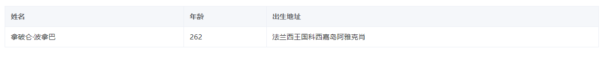

# 描述列表组件（descriptions）

> 地址
> /components/descriptions/bigDescriptions.js

> 引用
> import bigDescriptions from '/components/descriptions/bigDescriptions.js'

> 注册
> components 对象内注册 bigDialog 和引用时起的名字相同

> 使用

```js
// html
<big-descriptions :config="config" :render="render" :event="event" :behavior="behavior"></big-descriptions>

// js
data() {
    return {
        config: {
	    	column: 3,
	    	data: {
	    	    'name': '拿破仑·波拿巴',
	    	    'age': 254,
	    	    'address': '法兰西王国科西嘉岛阿雅克肖',
	    	},
	    	labelDetail: [
	    	    {
	    	        name: 'name',
	    	        label: '姓名',
	    	        span: 3,
	    	    }, {
	    	        name: 'age',
	    	        label: '年龄',
	    	        span: 3,
	    	    }, {
	    	        name: 'address',
	    	        label: '出生地址',
	    	        span: 3,
	    	    }
	    	],
		},
		render: {
		    border: true,
		},
        event: {
            
        },
        behavior: {
            
        }
    }
}
```



## 属性

| 参数名   | 数据类型 | 说明         | 默认值 |
| -------- | -------- | ------------ | ------ |
| config   | Object   | 基本数据     | 必填   |
| render   | Object   | 控制渲染样式 | {}     |
| event    | Object   | 方法         | {}     |
| behavior | Object   | 行为         | {}     |

### config

```js
config: {
    // 一行 信息 的数量 默认值为3
    column: 3,
    // 渲染值对象
    data: {
        'name': '拿破仑·波拿巴',
        'age': 254,
        'address': '法兰西王国科西嘉岛阿雅克肖',
    },
    // 渲染信息label信息
    labelDetail: [
        {
            // 对应data中的key 要渲染的值
            name: 'name',
            // 渲染的label
            label: '姓名',
            // 占据列的数量 默认值为1


            span: 1,
        }, {
            // 插槽名 使用插槽
            slotName: 'description-age',
            name: 'age',
            label: '年龄',
            span: 1,
        }, {
            name: 'address',
            label: '出生地址',
            span: 1,
        }
    ],
},
```

### render

```js
render: {
    // 是否带有边框 默认为false
    border: true,
    // 排列的方向 vertical / horizontal 默认值为vertical
    direction:'vertical',
}
```

### event

暂无

### behavior

暂无

