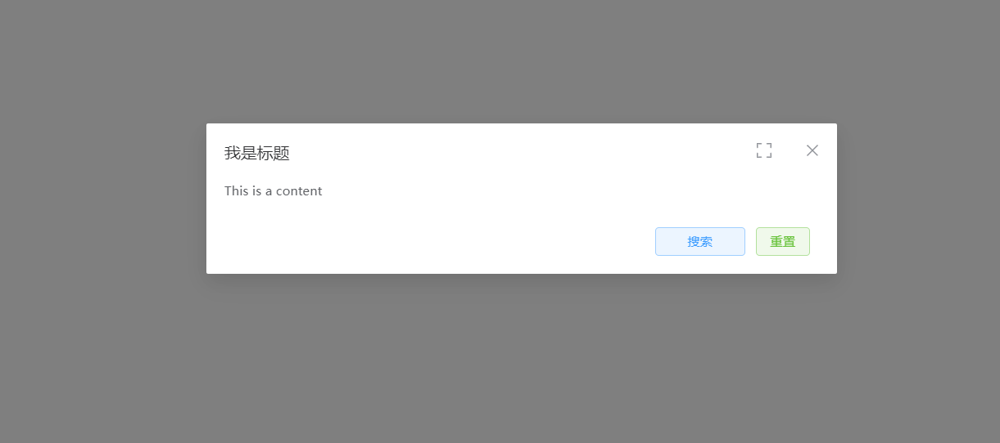
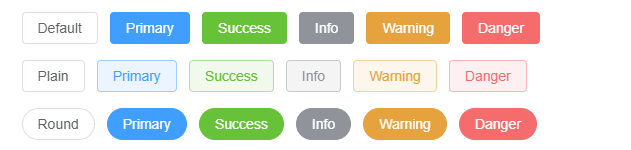

# 弹窗组件（dialog）

> 地址
> /components/dialog/bigDialog.js

> 引用
> import bigDialog from '/components/dialog/bigDialog.js'

> 注册
> components 对象内注册 bigDialog 和引用时起的名字相同

> 使用

```js
//html
<big-dialog :config="config" :render="render" :event="event" :behavior="behavior" ></big-dialog>
//js
data(){
    return{
        config: {
            show: true,
            title: '我是标题',
            //操作按钮
            operation:[
                {
                    value: '搜索',
                    type: 'primary',
                    plain: true,
                    method: this.btnClick,
                    width: '100px'
                }, {
                    value: '重置',
                    type: 'success',
                    plain: true,
                    method: this.resetQuery
                }
            ]
    	},
    	render: {
    	    width: '700px'
    	},
    	event: {},
    	behavior: {
    	    close: true,
    	    room: true,
    	    draggable: true,
    	    modal: true,
    	    closeOnClickModal: true,
    	    closeOnPressEscape: true,
            destroyOnClose: false,
    	}
    }
   
}
```


## 属性

| 参数名   | 数据类型 | 说明         | 默认值 |
| -------- | -------- | ------------ | ------ |
| config   | Object   | 基本数据     | 必填   |
| render   | Object   | 控制渲染样式 | {}     |
| event    | Object   | 方法         | {}     |
| behavior | Object   | 行为         | {}     |

### config

```js
config: {
	//组件是否弹出
    show: true,
    //弹出框标题
    title: '我是标题',
    //弹出框底部操作按钮
    operation:[
        {
            value: '搜索',
            type: 'primary',
            plain: true,
            method: this.btnClick,
            width: '100px'
        }, {
            value: '重置',
            type: 'success',
            plain: true,
            method: this.resetQuery
        }
    ]
},
```

### render

```js
render: {
    //弹框宽
    width: '700px'
},
```

### event

```js
event: {
    
},
```

### behavior

```js
behavior: {
    // 是否显示关闭按钮
    close: true,
    // 是否显示全屏按钮
    room: true,
    // 为 Dialog 启用可拖拽功能
    draggable: true,
    // 是否需要遮罩层
    modal: true,
    // 是否可以通过点击 modal 关闭 Dialog
    closeOnClickModal: true,
    // 是否可以通过按下 ESC 关闭 Dialog
    closeOnPressEscape: true,
    // 当关闭 Dialog 时，销毁其中的元素
    destroyOnClose:true,
}
```




## 插槽

| 插槽名 | 说明                             |
| ------ | -------------------------------- |
| ——     | Dialog 的内容                    |
| header | 对话框标题的内容；会替换标题部分 |
| footer | Dialog 按钮操作区的内容          |

