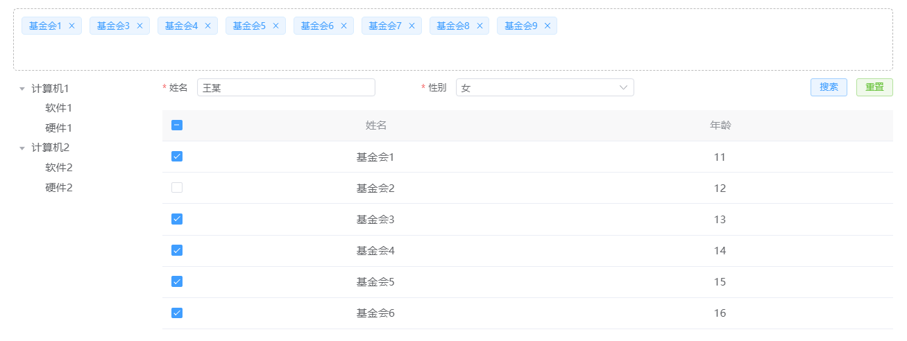

# 列表选择器面板（listSelect）

> 地址
> /components/listSelectPanel/bigListSelectPanel.js

> 引用
> import bigListSelectPanel from '/components/listSelectPanel/bigListSelectPanel.js'

> 注册
> components 对象内注册 bigListSelectPanel 和引用时起的名字相同

> 使用

```js
// html
<big-multi-select 
	v-model:selected-data="selectedData"
	:config="config"
	:render="render"
	:event="event"
	:behavior="behavior">
</big-multi-select>

// js数据
data(){
	return{
        selectedData:[],
        config: {
            name:'name',
            key:'id',
            // 分页信息
            paginationDetail:{
                 config: {
				    pageSize: 10,
				    pageNum: 1,
				    total: 10,
				}
            },
            // 表格信息
            tableDetail:{
                config:{
                    tableData:[
                        {age:11, id:1,name:'基金会1',},
                        {age:12, id:2,name:'基金会2',},
                    ],
                    tableLabel:[
                        {label: '姓名',prop: 'name',},
                        {label: '年龄',prop: 'age',}
                    ],
                }
            },
            // 搜索表单信息 详细见搜索表单
            formDetail:{
                config: {
                    formArray: [
                        {
                        	config: {
                        		name: 'name',//表单控件绑定值
                        		label: '姓名',//表单控件label
                        	}
                    	}
                    ]
                }, 
                
            },
		},
    }
}

```




## 属性

| 参数名   | 数据类型 | 说明         | 默认值 |
| -------- | -------- | ------------ | ------ |
| v-model:selected-data | Array | 当前选择的数据 | 必填 |
| config   | Object   | 基本数据     | 必填   |
| render   | Object   | 控制渲染样式 | {}     |
| event    | Object   | 方法         | {}     |
| behavior | Object   | 行为         | {}     |

### config

| 参数名   | 数据类型 | 说明         | 默认值 |
| -------- | -------- | ------------ | ------ |
| name | String | 选中值渲染的字段名 | name |
| key | String | 数据的唯一索引(不重复)| 必填 |
| paginationDetail | Object | 分页信息 | [请参考分页组件](face/components/paging)         |
| tableDetail | Object | 表格信息 | 必填                                             |
| formDetail | Object | 搜索表单信息 | [请参考搜索表单组件](face/components/searchForm) |
| treeDetail | Object | 树信息 | [请参考树组件](face/components/tree) |


```js
config: {
	name:'name',
	key:'id',
	// 分页信息(不需要请省略)
    paginationDetail:{
          config: {
          	pageSize: 10,
          	pageNum: 1,
          	total: 10,
      	}
	},
	// 表格信息 
	tableDetail:{
	    config:{
	        tableData:[
	            {age:11, id:1,name:'基金会1',},
	            {age:12, id:2,name:'基金会2',},
	        ],
	        tableLabel:[
	            {label: '姓名',prop: 'name',},
	            {label: '年龄',prop: 'age',}
	        ],
	    },
        behavior: {
            // 加载中 默认为false
            loading:true,
        }
	},
	// 搜索表单信息(不需要请省略)
	formDetail:{
		config: {
			formArray: [
			    {
			     	config: {
			     	   name: 'name',//表单控件绑定值
			     	   label: '姓名',//表单控件label
			     	}
				}
			]
		},   
	},
    // 树信息(不需要请省略)
    treeDetail: {
        config:{
            // 树配置
            props: {
                //指定选项的值为选项对象的某个属性值
                value: 'id',
                //指定选项标签为选项对象的某个属性值
                label: 'name',
                //指定选项的子选项为选项对象的某个属性值
                children: 'children',
                //是否严格的遵守父子节点不互相关联
                checkStrictly: false,
                // 指定选项禁用
                disabled:'disabled',
            },
            // 树选项内容
            options: [
                {
                    id: '1',
                    name: '计算机1',
                    disabled: false,//是否禁用
                    children: [
                        {
                            id: '1-1',
                            name: '软件1',
                            disabled: true,
                        }, {
                            id: '1-2',
                            name: '硬件1',
                            disabled: false,
                        },
                    ],
                }, {
                    id: '2',
                    name: '计算机2',
                    disabled: false,//是否禁用
                    children: [
                        {
                            id: '2-1',
                            name: '软件2',
                            disabled: true,
                        }, {
                            id: '2-2',
                            name: '硬件2',
                            disabled: false,
                        },
                    ],
                }
            ]
        },
        render:{},
        behavior: {
            // 加载中 默认为false
            loading:true,
            // 是否在第一次展开某个树节点后才渲染其子节点
            defaultExpandAll: true,
            // 是否在点击节点的时候展开或者收缩节点， 默认值为 true，如果为 false，则只有点箭头图标的时候才会展开或者收缩节点。
            expandOnClickNode: false,
            // 节点是否可被选择
            showCheckbox: false,
            // 是否在点击节点的时候选中节点，默认值为 false，即只有在点击复选框时才会选中节点。
            checkOnClickNode: false,
            // 是否每次只打开一个同级树节点展开 默认值为false
            accordion: false,
            // 在显示复选框的情况下，是否严格的遵循父子不互相关联的做法，默认为 false
            checkStrictly: false,
            //是否可以搜索
            showSearch: false,
            //搜索条件 
            searchKey: ['id', 'name'],
            // searchKey: 'id',
        },
    }
},
```

### render

```js
render: {
    // 树宽度 平分24份 树占据份数
    treeSpan: 4,
}
```

## 事件 (包含 tree 组件 searchForm 组件方法)

## 方法

| 方法名    | 说明               | 参数            |
| ---------------- | ------------------ | --------------- |
| setFormData | 设置表单对象值 | 表单对象 |
| getFormData | 获取表单对象 | —— |
| verificationForm | 获取form的验证对象 | 返回promise对象 |
| resetForm        | 重置表单           | ——              |
| updateForm       | 修改表单值         | key , value    |
