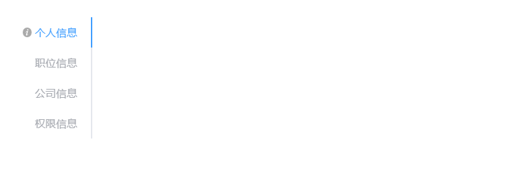

# tabSwitch组件

>引用
>import bigTabSwitch from '/components/tabSwitch/bigTabSwitch.js'

>注册
>components 对象内注册 bigTabSwitch 和引用时起的名字相同

>使用

```js
// html
<big-tab-switch :config="config" :render="render" :event="event" :behavior="behavior"></big-tab-switch>
// js
data(){
    return{
        
        config: {
            activeTab:'personnel-info',
            options: [
                {
                    name: 'personnel-info',
                    slotName: 'personnel-info',
                    label: '个人信息',
                    tip: '你要干什么，我不许',
                }, {
                    name: 'position-info',
                    slotName: 'position-info',
                    label: '职位信息',
                    disabled: true
                }, {
                    name: 'company-info',
                    slotName: 'company-info',
                    label: '公司信息',
                    disabled: true
                }, {
                    name: 'jurisdiction-info',
                    label: '权限信息',
                    slotName: 'jurisdiction-info',
                    disabled: true
                }
            ]
        },
        render: {},
        event: {},
        behavior: {}
    }
}
```


## 属性
| 参数名   | 数据类型 | 说明         | 默认值 |
| -------- | -------- | ------------ | ------ |
| config   | Object   | 基本数据     | 必填   |
| render   | Object   | 控制渲染样式 | {}     |
| event    | Object   | 方法         | {}     |
| behavior | Object   | 行为         | {}     |

### config

```js
config: {
    // 当前显示的tab项 选中选项卡的 name
    activeTab:'personnel-info',
    // tab项详细信息
    options: [
        {
            // tab项名称 标识符
            name: 'personnel-info',
            // 对应插槽的名称
            slotName: 'personnel-info',
            // label 渲染字段
            label: '个人信息',
            // tab提示信息
            tip: '你要干什么，我不许',
            // 是否被禁用 默认值为false
            disabled: true
        }, {
            name: 'position-info',
            slotName: 'position-info',
            label: '职位信息',
            disabled: true
        }, {
            name: 'company-info',
            slotName: 'company-info',
            label: '公司信息',
            // disabled: true
        }, {
            name: 'jurisdiction-info',
            label: '权限信息',
            slotName: 'jurisdiction-info',
            disabled: true
        }
    ]
},
```
### render
```js
render:{
    // 选项卡所在位置	top/right/bottom/left 默认值为left
    tabPosition:'left'
}
```

### config
```js
event:{
    //切换标签之前的钩子函数， 若返回 false  或者返回被 reject 的 Promise，则阻止切换。
    beforeLeave:function() {
      
    }
}
```