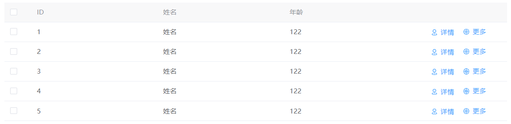

# table组件


>地址
>/components/table/bigTable.js

>引用
>import bigTable from '/components/table/bigTable.js'

>注册
>components 对象内注册 bigTable 和引用时起的名字相同

>使用
```js
//html
<big-table :config="config" :render="render" :event="event" :behavior="behavior"></big-table>

//js
data(){
    return{
    	config: {
    	    tableData: [
                {id: '1', name: '姓名', age: '122'},
                {id: '2', name: '姓名', age: '122'},
                {id: '3', name: '姓名', age: '122'},
                {id: '4', name: '姓名', age: '122'},
                {id: '5', name: '姓名', age: '122'},
    	    ],	
    	    tableLabel: [
    	    	{
    	    		label: 'ID',
    	    		prop: 'id',
    	    	}, {
    	    		label: '姓名',
    	    		prop: 'name',
    	    	},	 {
    	    		label: '年龄',
    	    		prop: 'age',
    	    	}
    	    ],
            operation: [
                 {
                     name: '详情',
                     icon: 'Place',
                     method: this.btnClick
                 },{
                     type: 'conceal',
                     name: '更多',
                     icon: 'Orange',
                 },
             ],
        },
    	render: {
    	    border: false,
    	    operationWidth: '200px',
    	},
    	behavior: {
    	    selected: true,
    	    rokId: 'id',
    	    treeProps: {
    	        children: 'proChildren'
    	    },
    	},
    	event: {}
    }

}

```
~~~~

## 属性
| 参数名   | 数据类型 | 说明         | 默认值 |
| -------- | -------- | ------------ | ------ |
| config   | Object   | 基本数据     | 必填   |
| render   | Object   | 控制渲染样式 | {}     |
| event    | Object   | 方法         | {}     |
| behavior | Object   | 行为         | {}     |

```js
config: {
    //行末尾操作按钮
    operation: [
        {
            // 渲染名称
            name: '详情',
            // 图标
            icon: 'Place',
            // 点击事件
            method: ()=>{
                return true
            },
            // 是否隐藏 返回true为隐藏 默认为false 接受参数为 该行信息
            hide:(row)=>{
                return true
            },
            // 是否禁用 返回true为禁用 默认为false  接受参数为 该行信息
            disabled:(row)=>{
                return true
            }
        },{
            type: 'conceal',
            name: '更多',
            icon: 'Orange',
            detail:[
                {
                    name: '更多',
                    icon: 'Orange',
                    method: ()=>{
                        return true
                    },
                }
            ]
        }
    ],
	// 表格渲染行数据
    tableData: [
        {id: '1', name: '姓名', age: '122'},
        {id: '2', name: '姓名', age: '122'},
        {id: '3', name: '姓名', age: '122'},
        {id: '4', name: '姓名', age: '122'},
        {id: '5', name: '姓名', age: '122'},
    ],
    // 表格渲染列
    tableLabel: [
        {
            // 插槽名（开启插槽）
            slotName:"aaa-table",
            // 表头渲染内容
            label: 'ID',
            // 该列渲染字段(对应 tableData 中的 key)
            prop: 'id',
            // 列固定 true/left为左固定 'right'为右固定
            fixed:'',
            // 列是否可隐藏 默认为false
            hidable: false,
        }, {
            label: '姓名',
            prop: 'name',
        }, {
            label: '年龄',
            prop: 'age',
        }
    ],
},
render: {
    // 列的边框线 开启后可以拖拽列宽
    border: false,
    // 行末尾操作按钮宽度
    operationWidth: '200px',
    // 表格最大高度
    maxHeight: 200,

},
behavior: {
    // 加载中 默认为false
    loading:true,
    // 表格复选框
    selected: true,
    // 行主键 设置后开启树形表格
    rokId: 'id',
    // 树形表格的配置
    treeProps: { 
        children: 'proChildren' //配置 指定树节点名称
    },
    // 表格索引 默认为false
    index:true,
    // 可控制隐藏列
    hidableColumn:true,
    // 是否懒加载子节点，需与 loadNode 方法结合使用
    lazy:false,
},
event: {
    // 加载子节点数据的函数，lazy 为 true 时生效
    // row 当前点击行信息
    // node 当前点击节点信息
	// resolve 数据加载完成的回调(必须调用)
    loadNode:(row，node, resolve)=>{
    	let data=[]
    	resolve(data)
    }，
    
    // 单元格的 style 的回调方法，也可以使用一个固定的 Object 为所有单元格设置一样的 Style。
    setCellStyle:(res)=>{
        return {
            color:"#ff0000"
        }
    }，
    
    // 仅对 type=selection 的列有效，返回值用来决定这一行的 CheckBox 是否可以勾选
    selectable:(row, index)=>{
         return true
    }
}
```

## 事件

| 事件名 | 说明 | 参数 |
| ------ | ---- | ---- |
| cell-click | 当某个单元格被点击时会触发该事件 | row, column, cell, event |
| cell-dblclick | 当某个单元格被双击击时会触发该事件 | row, column, cell, event |
| cell-contextmenu | 当某个单元格被鼠标右键点击时会触发该事件 | row, column, cell, event |
| row-click | 当某一行被点击时会触发该事件 | row, column, event |
| row-contextmenu | 当某一行被鼠标右键点击时会触发该事件 | row, column, event |
| row-dblclick | 当某一行被双击时会触发该事件 | row, column, event |
| selection | 当用户手动勾选数据行的 Checkbox 时触发的事件 | selection, row |
| selection-change | 当选择项发生变化时会触发该事件 | selection |
| select-all       | 当用户手动勾选全选 Checkbox 时触发的事件 | selection |

## 方法

| 方法名 | 说明 | 参数 |
| ------ | ---- | ---- |
| getSelectionRows       | 获取表格当前已选择项         |     |
|        |      |      |
|        |      |      |

