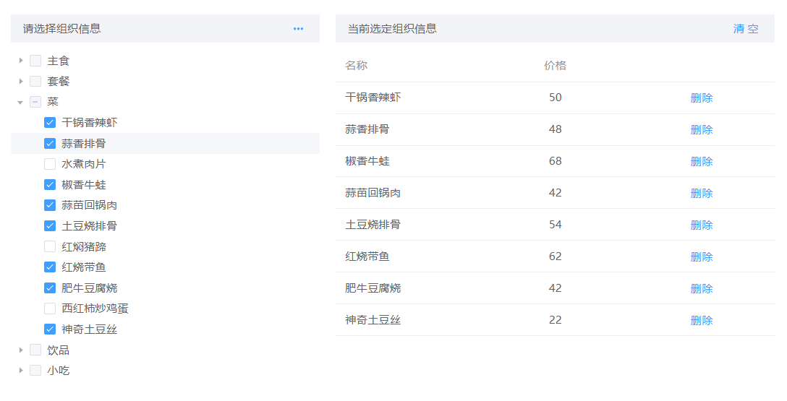

# 树选择器面板（listSelect）

> 地址
> /components/treeSelectPanel/bigTreeSelectPanel.js

> 引用
> import bigTreeSelectPanel from '/components/treeSelectPanel/bigTreeSelectPanel.js'

> 注册
> components 对象内注册 bigTreeSelectPanel 和引用时起的名字相同

> 使用

```js
<big-tree-select-panel 
	:config="config" 
	:render="render" 
	:behavior="behavior" 
	:event="event">
</big-tree-select-panel>

data() {
	return {
		config: {
			treeTitle: '请选择组织信息',
			tableTitle: '当前选定组织信息',
			treeData: [
			    {
			        name: '主食',
			        id: '1',
			        disabled: true,
			        children: [
			            {
			                name: '馒头',
			                id: '1-1',
			                price: '2',
			            }, {
			                name: '花卷',
			                id: '1-2',
			                price: '2.5',
			            }, {
			                name: '大饼',
			                id: '1-3',
			                price: '4',
			            }, {
			                name: '米饭',
			                id: '1-4',
			                price: '2',
			            },
			        ]
			    }
			],
			selectedData: [],
			treeProps: {
			    key: 'id',
			    label: 'name',
			    children: 'children',
			},
			tableLabel: [
			    {
			        label: '名称',
			        prop: 'name',
			        align: ''
			    }, {
			        label: '价格',
			        prop: 'price',
			        align: 'center'
			    }
			],
		},
	}
}
```



## 属性

| 参数名   | 数据类型 | 说明         | 默认值 |
| -------- | -------- | ------------ | ------ |
| config   | Object   | 基本数据     | 必填   |
| render   | Object   | 控制渲染样式 | {}     |
| event    | Object   | 方法         | {}     |
| behavior | Object   | 行为         | {}     |

### config

```js
config: {
    // 树头部信息提示
	treeTitle: '请选择组织信息',
    // 表格头部信息提示
	tableTitle: '当前选定组织信息',
    // 树信息
	treeData: [
	    {
	        name: '主食',
	        id: '1',
	        disabled: true,
	        children: [
	            {
	                prop: '馒头',
	                id: '1-1',
	                price: '2',
	            }, {
	                name: '花卷',
	                id: '1-2',
	                price: '2.5',
	            }, {
	                name: '大饼',
	                id: '1-3',
	                price: '4',
	            }, {
	                name: '米饭',
	                id: '1-4',
	                price: '2',
	            },
	        ]
	    }
	],
    // 已选择的列表
	selectedData: [],
    // 树配置信息
	treeProps: {
		// 唯一标识 不重复
	    key: 'id',
		// 指定节点标签为节点对象的某个属性值
	    label: 'name',
		// 指定子树为节点对象的某个属性值
		children: 'children',
		// 指定节点选择框是否禁用为节点对象的某个属性值
		disabled:'disabled',
	},
	// 表格列表信息 
	tableLabel: [
	    {
	        label: '名称',
	        prop: 'name',
	        align: ''
	    }, {
	        label: '价格',
	        prop: 'price',
	        align: 'center'
	    }
	],
},
```

### behavior

```js
behavior: {
    // 树加载中
    treeLoading:true,
    // 表格加载中
    tableLoading:true,
    // 是否只可以选择叶节点 默认是false
    isLeafSelect: true,
    // 是否在点击节点的时候展开或者收缩节点， 默认值为 true，如果为 false，则只有点箭头图标的时候才会展开或者收缩节点。
    expandOnClickNode: true,
    // 是否在点击节点的时候选中节点，默认值为 false，即只有在点击复选框时才会选中节点。
    checkOnClickNode: true,
    // 是否每次只打开一个同级树节点展开 默认值为false
    accordion: false,
    // 在显示复选框的情况下，是否严格的遵循父子不互相关联的做法，默认为 false
    checkStrictly: false,

},
```

