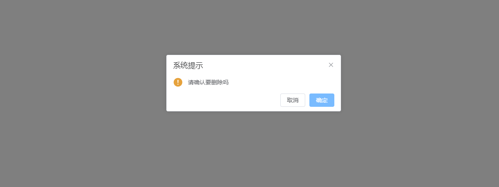

# modal（模态框对象）

>地址
>/plugins/modal.js

>引用
>import modal from './plugins/modal.js'

> 注册
> 创建vue对象后挂载至vue对向上

```js
app.use(modal)
```

> 使用

```js
this.$modal.msg('this is a message')
```


## 消息提醒

> msg（普通提示框）
>
> 参数：要提示的信息

```js
this.$modal.msg('this is a message');
```


> msgError(错误提示框)
>
> 参数：要提示的信息

```js
this.$modal.msgError('this is a error message');
```

> msgSuccess(成功提示框)
>
> 参数：要提示的信息

```js
this.$modal.msgSuccess('this is a success message');
```

> msgWarning(提醒提示框)
>
> 参数：要提示的信息

```js
this.$modal.msgWarning('this is a warning message');
```


## 弹出提示

> alert(普通弹出提示)
>
> 参数：要弹出的信息

```js
this.$modal.alert('this is a message')
```


>alertError(普通错误提示)
>
>参数：要弹出的信息

```js
this.$modal.alertError('this is a error message')
```


>alertSuccess(成功弹出提示)
>
>参数：要弹出的信息

```js
this.$modal.alertSuccess('this is a success message')
```


>alertWarning(提醒弹出提示)
>
>参数：要弹出的信息

```js
this.$modal.alertWarning('this is a warning message')
```


## 通知提示

>notify(普通通知提示)
>
>参数：要提示的信息

```js
this.$modal.notify('this is a message')
```

>notifyError(错误通知提示)
>
>参数：要提示的信息

```js
this.$modal.notifyError('this is a error message')
```

>notifySuccess(成功通知提示)
>
>参数：要提示的信息

```js
this.$modal.notifySuccess('this is a success message')
```

>notifyWarning(提醒通知提示)
>
>参数：要提示的信息

```js
this.$modal.notifyWarning('this is a warning message')
```


## 确认弹窗

>confirm(确认窗体)
>
>参数：要确认的信息
>
>返回值：返回一个`Promise` 

```js
this.$modal.confirm('请确认要删除吗').then(()=>{
    console.log('要删除')
}).catch(()=>{
    console.log('不要删除')
})
```



## 提交内容

>prompt(提交内容窗体)
>
>参数：输入信息的提示
>
>返回值：返回一个promise  then中接收一个对象 输入值的key为value

```js
this.$modal.prompt('输入手机号').then((res)=>{
    console.log(res)
    console.log('提交手机号')
}).catch((err)=>{
    console.log('取消提交')
})
```


## 遮罩层

>loading(打开遮罩层)
>
>参数：显示在加载图标下方的加载文案

```js
this.$modal.loading("this is a message");
```


>closeLoading(关闭遮罩层)

```js
this.$modal.closeLoading();
```