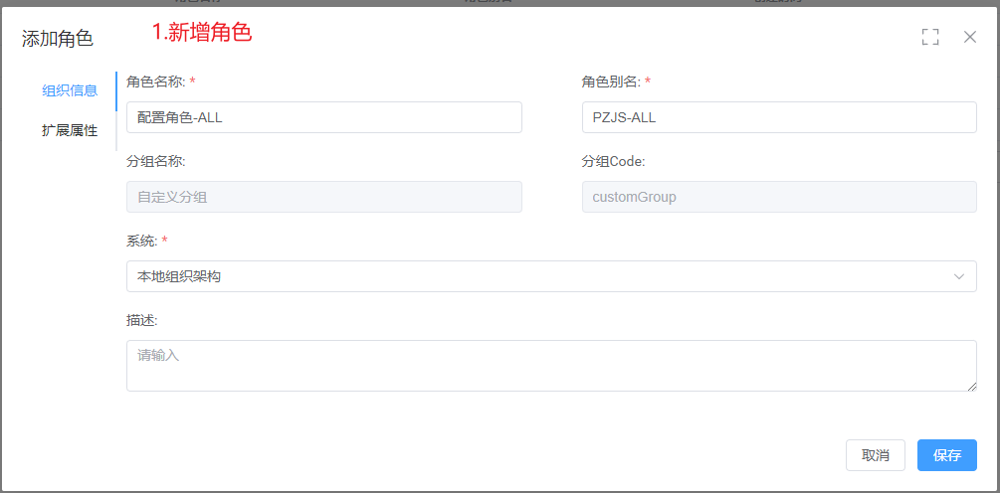
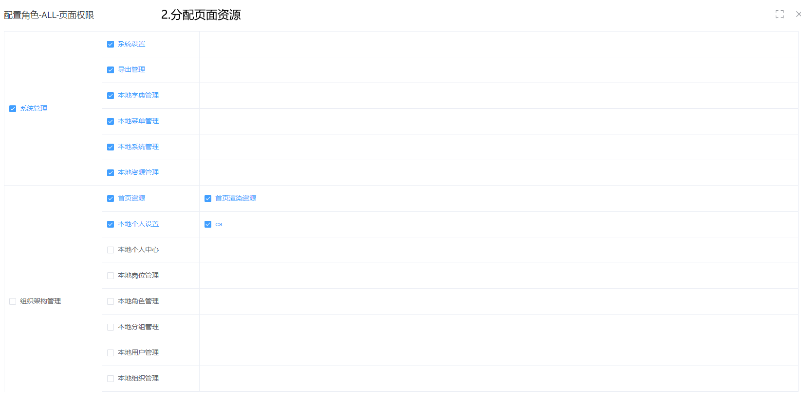

# 权限验证

> 前言
>
> 权限验证使用说明
## 引入依赖

```xml
<dependency>
  <groupId>cn.ifloat.brick.sprofile</groupId>
  <artifactId>brick-sso-common</artifactId>
  <version>1.0.0-SNAPSHOT</version>
</dependency>
```

## 页面权限验证

### 添加页面资源

> 新增页面资源:
>
> - 初始化页面资源,参考**初始化页面资源文件**
>   - 创建页面资源:在资源管理,选择

### 配置页面权限验证

> 在console服务,对应页面Controller上编写注解 **@SaCheckPermission()**
>
> 参数:
>
> - **value**:填写该页面资源所对应的资源CODE,可以配置多项,以配置不同环境下的资源 例 :BDZZGL,CSZZGL
>   - 对应初始化页面资源中的 **prc** 属性
>   - 值为该页面资源所属功能分类CODE与资源CODE拼接,使用 **.** 做拼接符 ,例 : ZZJGGL.SYZY
> - **orRole**:填写该页面资源所对应的功能分组CODE,可以配置多项,,以配置不同环境下的资源
>   - 对应初始化页面资源所属功能分类code,对应 **fc**属性
> - **mode**:
>   - **AND**:即**value**和**orRole**两者验证必须同时满足,才可以通过验证,否则无法通过验证
>   - **OR**:即**value**和**orRole**两者验证有一种满足即可,优先验证**value**
>   - 默认模式:**AND**

```java
@SaCheckPermission(value = {"ADMIN","BDZZGL","CSZZGL"},mode = SaMode.OR ,orRole = {"ADMIN","XTGL"})
```

### 用户配置页面权限

> 为某一用户配置页面权限
>
> 1. 在角色管理,选择系统后,点击新增,进行新增角色操作
> 2. 在新建的角色右侧,点击更多,点击页面资源,给角色分配页面资源





## 数据资源验证

### 添加数据资源

> 添加数据资源,参考**初始化数据资源文件**

### 用户配置数据资源

!> 分配**数据资源**之前,需分配相应的**页面资源**,该角色只能分配该角色**已拥有**的**页面资源**所属**功能分类**下的**数据资源**

> 1. 在**角色管理**页面,点击角色右侧**更多**按钮 ,点击**数据资源**,分配角色数据权限
> 2. 用户分配角色:
>    1. 为该角色分配用户,或在用户管理页面分配角色,则该用户拥有该角色所对应的页面权限及数据权限
>    2. 或为某一组织或岗位分配相应的角色,则归属于该岗位或组织的用户则拥有相应的角色权限

?> 权限设置下拉部分详情请详见**初始化数据资源**


> 数据权限分配之后,在获取对应的数据列表时,当查询的表为该用户配置过的数据权限时,SQL语句会自动拼接已经设置过的数据权限
>

### 跳过数据权限验证

> 设置数据权限后,在当前用户访问数据资源时,当访问数据资源的表名,与该用户所设置的数据权限一致时,查询就会自动拼接数据权限
>
> 在某些场景下,并不需要数据权限去过滤时,需要使用在mapper文件上,使用**@IgnoreDataRule**注解

```java
@Select(value = SQL)
List<BResRoleMapperVo> listVo(@Param(Constants.WRAPPER) Wrapper wrapper);

@Select(value = SQL)
@IgnoreDataRule//在需要跳过数据权限时,调用此方法
List<BResRoleMapperVo> getList(@Param(Constants.WRAPPER) Wrapper wrapper);
```
