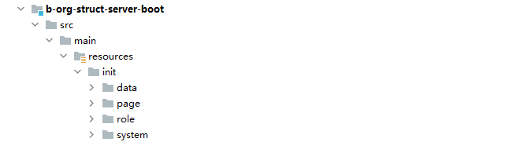

# 初始化系统数据

> 前言
>
> 便于初次初始化系统或新增系统资源时,将默认资源初始化到系统内

## 创建初始化文件

### 初始化文件路径

> 系统的初始化资源共需四类,分别为:
>
> ​	1.数据资源--data
>
> ​	2.页面及渲染资源--page
>
> ​	3.角色--role
>
> ​	4.系统--system

?> 文件夹的路径与命名需与下方图示一致



### 初始化系统文件

?> 初始化文件中的**CODE**以及数级资源文件中的**数据库表名**,**字段名**需要**大写**

> 系统初始化文件名称:
>
> system_init*.json


```json
[
  {
    "sn":"本地组织架构",//系统名称
    "sc":"BDZZJG",//系统CODE--唯一(大写)
    "domain":"http://server.inspect.cn:8088",//系统域名
    "logo":"2023/04/24/a98e61f8-c40b-4380-b2e5-ab024fb8f7ea.png",//系统图片
    "defaultUrl":"/bos/org/default/page",//系统首页域名
    "defaultImg":"House",//系统首页图标
    "defaultName":"工作台"//系统首页名称 
  }
]
```

?> 以下资源文件需先初始化系统文件

### 初始化页面及渲染资源文件

> 页面及渲染资源初始化文件名称:
>
> page_init*.json


> **功能分类** 是指部分资源同属于某一类型下的情况,所提供的类型分组
>
> 例如:员工页面资源,员工新增按钮,员工删除按钮,员工列表等同属于**员工管理**分类下

```json
[
  {
    "sn":"本地组织架构",//系统名称
    "sc":"BDZZJG",//系统CODE(大写)
    "fs":[//功能分类列表集合
      {
        "fn":"组织架构管理",//功能分类名称
        "fc":"ZZJGGL",//功能分类CODE(大写)
        "prs":[//页面资源列表集合
          {
            "prn":"首页资源",//页面资源名称
            "prc":"SYZY",//页面资源CODE(大写)
            "pri":"/bos/org/default/page",//页面资源URI
            "rrs":[//渲染资源列表集合
              {
                "rrn":"首页渲染资源",//渲染资源名称
                "rrc":"SYXRZY"//渲染资源CODE(大写)
              }
            ]
          }
        ]
      }
    ]
  }
]
```

### 初始化数据资源文件

> 数据资源初始化文件名称:
>
> data_init*.json


> **drn**:数据库表名称,填写该业务涉及对应数据库表名称
>
> **drcn**:数据库表列名称,填写该数据库表设置的数据权限所对应的数据库表字列名

```json
[
  {
    "sn":"本地组织架构",//系统名称
    "sc":"BDZZJG",//系统CODE(大写)
    "fs":[//功能分类列表集合
      {
        "fn":"组织架构管理",//功能分类名称
        "fc":"ZZJGGL",//功能分类CODE(大写)
        "ds":[//数据资源列表集合
          {
            "drn":"岗位表",//数据资源名称
            "drtn":"B_JOB",//数据库表名称(大写)
            "drc":"B_JOB",//数据资源CODE(大写)
            "drcs":[//数据资源列详情列表
              {
                "drcn":"FULL_ID",//数据库表对应列名称(大写)
                "drps":"岗位ID",//数据库表对应列描述
                "drpc": "JOB_ID",//数据资源详情列CODE(大写)
                "drctype":"JOB"//权限模式CODE(参考下图表)
              }
            ]
          }
        ]
      }
    ]
  }	
]
```

> 权限模式CODE表

| 权限模式CODE | 权限模式描述 |                           权限范围                           |
| :----------: | :----------: | :----------------------------------------------------------: |
|     EMP      |   员工模式   |        CUR_EMP(当前人),SEL_EMP(指定人)                                                      |
|     ORG      |   组织模式   | CUR_ORG(当前组织),SEL_ORG(指定组织),CUR_CASD_ORG(当前组织及以下),SEL_CASD_ORG(指定组织及以下) |
|     JOB      |   岗位模式   | CUR_JOB(当前岗位),SEL_JOB(指定岗位),CUR_CASD_JOB(当前岗位及以下),SEL_CASD_JOB(指定岗位及以下) |
|    STATIC    |   静态模式   |                        STATIC(静态值)                        |

### 初始化角色文件

> 角色初始化文件名称:
>
> role_init*.json


> 权限标识:
>
> 权限标识共有两种,一种为**FUN**,一种为**RES**
>
> 当权限标识为**FUN**时,所对应的资源CODE为功能分类的CODE,代表该角色拥有该功能分类的全部权限
>
> 当权限标识为**RES**时,所对应的资源CODE为资源CODE,,代表该角色拥有该资源所对应的权限
> 
> 在填写权限标识为**RES**的资源时,对应的资源CODE应为该资源CODE所属**功能分类CODE与资源CODE**拼接,使用 **.** 做拼接符 例: ZZJGGL.SYZY

> 初始化角色规则
>
> 每个功能分类下默认存在两种角色:
>
> - 一种为拥有该功能分组的**全量权限**的角色(只能创建**一个**)
> - 一种为拥有该功能分组下其中一个页面资源**只读权限**的角色(可以创建**多个**)

?> 目前初始化角色不支持初始化数据权限,仅支持页面,及渲染权限

```json
[
  {
    "sn":"本地组织架构",//系统名称
    "sc":"BDZZJG",//系统CODE(大写)
    "fs":[//功能分类列表集合
      {
        "fn":"组织架构管理",//功能分类名称
        "fc":"ZZJGGL",//功能分类CODE(大写)
        "rls":[//角色列表集合
          {
            "rln":"组织架构-ALL",//角色名称
            "rlc":"ZZJG-ALL",//角色CODE(大写)
            "rs":[//权限列表
              {
                "type":"FUN",//权限标识
                "code":"ZZJGGL"//资源CODE(大写)
              }
            ]
          },
          {
            "rln":"员工管理-READ",//角色名称
            "rlc":"YGGL-READ",//角色CODE(大写)
            "rs":[
              {
                "type":"RES",//权限标识
                "code":"ZZJGGL.EMP"//资源CODE(大写)
              }
            ]
          },
          {
            "rln":"组织管理-READ",//角色名称
            "rlc":"ORG-READ",//角色CODE(大写)
            "rs":[
              {
                "type":"RES",//权限标识
                "code":"ZZJGGL.ORG"//资源CODE(大写)
              }
            ]
          }
        ]
      }
    ]
  }
]
```


## 初始化文件

> 文件创建完成后,需要先将项目启动,然后在组织架构的server服务中配置该系统域名


> 在组织架构中,找到系统设置,点击数据同步按钮
>


> 初始化文件运行规则
>
> - 所有文件以数据库中的数据为准,避免因为初始化文件导致修改过的资源数据回退
> - 系统文件:
>   - 当初始化文件中的code与数据库的code一致时,会跳过文件中的数据
>
> - 资源文件:
>   - 系统CODE相同:
>     - 当初始化文件中的code与当前系统中的code一致时,会跳过文件中的重复CODE的数据
>   - 系统CODE不同:
>     - 当初始化文件中的code与其他系统中的code重复时,会抛出重复的资源异常,并回滚全部的操作,并与日志中打印重复的初始化信息
