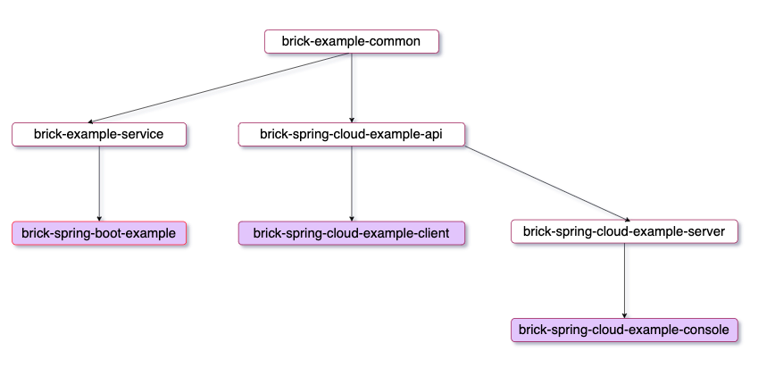

#开发规约

> **前言** 
>
> 在过往经历当中我们总会遇到如下问题:
>
> 	1. 同事的代码很难阅读, 要花费很多时间在难以理解的代码设计, 抽象的命名规则.
> 	2. 引入一些为了解决当下的问题的第三方依赖,导致一些项目组件冲突.
> 	3. 代码当中出现比如递归\嵌套循环\慢sql编写\
> 	4. 容错率低下,代码运行后容易被穿透,变量值非法传入临界值导致整个系统数据发生错乱
> 	5. 定义的变量随着单例模式而不释放, 变量使用度不高,导致整个项目运行时需要大量的内存支撑
>
> 这些问题很大程度是因为没有一个统一且良好的代码规范,执行的也差强人意,往往一个项目会因为这些问题积累到一定程度,优化和迭代都很难进行. 如果一个项目非业务瓶颈导致生命周期快速消亡,这恰恰说明一个清晰的架构,一个良好的代码规范的产物的重要性.
>
> **规约** 是把双刃剑,强约束会带来开发效率降低,但是可维护成本也随之降低,我们必须在这其中做出取舍. 何况当你掌握规范`开发,效率会线性提高.

## 项目结构规范

### Maven 模块化

!> 这里不说明maven模块化相关的技术说明,只强调模块化后的工程结构和作用

> * 父子模块
>   * 一个完整的工程需要有一个**父模块**和多个**子模块**,这样我们可以在父模块中传递一些公共依赖或定义,到子模块它的好处:
>     * 可以同时操作多个子模块的maven生命周期避免多模块单独操作`clean install`
>     * 可以以继承的方式定义公共组件的版本,定义依赖管理器和插件管理器
> * 可运行模块和普通模块
>   * 多模块情况下是为了解耦公共代码重复定义这样子模块之间会有依赖关系.子模块的类型可以用packaging方式来区分,但目前更多的**SpringBoot**的方式内嵌Web容器编译成一个jar来进行部署.这样我们的jar就区分为 可执行子节点 和 可依赖的子节点
>
> 下例视图是 SpringBoot 和 SpringCloud 这两个可执行的节点整体说明模块定义
>



> 白色背景的模块是可依赖的jar,紫色背景的节点是可执行jar,这张图能完全说明子模块之间的关系.
>
> 1. **brick-example-common** 中有项目里所需要的 `model` `view pojo` `基础异常类`几乎只要是很多模块都需要的东西都可以在这一层声明
> 2. **brick-example-service** 中是整个项目的所有业务逻辑的体现的地方包括对数据库操作的sql文件
> 3. **brick-spring-boot-example** 是一个最典型的`SpringBoot` 启动入口的项目,里面包含着启动锁需要的配置文件以及静态资源或者页面模版,它可以是一个Web容器
> 4. **brick-spring-cloud-example-api** 定义所有`SpringCloud` 远程调用接口声明(所谓接口是行为,具体的接口和参数就是指``model`  `view pojo` 所以它和 ``brick-example-common 有依赖关系`)
> 5. **brick-spring-cloud-example-server** 是`brick-spring-cloud-example-api` 所有定义接口的实现
>    1. 看起来它很像 `brick-example-service` 甚至可以 `brick-spring-cloud-example-api` + `brick-spring-cloud-example-server` 同等于 `brick-example-service` 但是为什么要把它拆成两个子模块呢? 这就关系到微服务环境下,客户端角色是不关注实现的,但是它必须要有声明才能远程调用接口.所以在模块划分上 `SpringBoot` 和 `SpringCloud` 会有一些区别
>    2. 甚至它可以依赖`brick-example-service(业务逻辑都要体现在service这一层中)` server本身可以不做任何事情,但结构依然要保留这样增加了扩展性(毕竟本地调用和远程调用还是有区别,有的时候虽然逻辑一样但是 入参出参会有区别)
> 6. **brick-spring-cloud-example-client** 和 **brick-spring-cloud-example-console** 其实是一样的,为了再示例当中清楚的描述客户端和服务端的两个不同的角色,所以这样构建了client与console(server) `实际开发中服务端和客户端是耦合在一起,你作为别人服务端,但同样你本身也是一个客户端要去调其他服务`
> 7. **brick-spring-cloud-example-client** 和 **brick-spring-cloud-example-console** 也许是一个web站点里面要跳转页面, 也许是GateWay垂直包装的服务 但他们的目的是一样的要给客户端(所谓客户端不限于pc&wbe&小程序&gateway&server)提供数据支持

## 代码设计规范

?> 健康的身体要养成健康的习惯,变成亦是

### 命名规范

!> 类 & 接口类 & 枚举类 不能以特殊字符包含数字开头, 必须以UpperCamelCase形式

```javascript
//正确
User  UserDao  UserService  UserService UserServiceImpl  UserController  UserApi  UserServer UserEnum
//错误
user  USER  USer 
```

!> 方法名 & 参数名 & 成员变量 & 局部变量 统一用lowerCamelCase 形式,尽量用英语语法表达, 避免使用汉语拼音来命名,, 严禁使用太抽象的名字,尽量见名知义

```javascript
//正确
user example  _condition  userName  caozuo()  show()  
//错误
taycan  king  King  
```

!> 尽量少用缩写,  严禁不能完全体现含义的缩写方式

```javascript
//正确
userCtrl  
//错误
userC  userCond
```

?> 常量名 & 枚举属性名  以全大写形式多个单词以"_"分割

```javascript
//正确
STUDENT_STATUS  SUCCESS
//错误
student_status  success
```

?> 各个层命名规范 建议统一

```javascript
//建议
User  UserVo	UserDao		UserMapper	 UserService  UserController	UserApi 	UserServer 
```

?> 包名强约束为 `cn.*.app.*` 因为项目中约定符合这种规范的包会加入到Ioc扫描中

```javascript
//正确
cn.demo.app.domain
cn.yi.app.domain 
cn.yi.app.domain.vo
cn.yi.app.mappers
cn.yi.app.service
cn.yi.app.service.impl
cn.yi.app.controller
```

?> 数据库命名 table column 强烈约束全部大写多个词"_"分割(brick中 用到mybaisplus 约定配置否则会orm映射不到)

```sql
-- 正确
select ID,USER_NAME,DEP_NAME from USER_INFO
```

### 注释规范

?> 所有类 & 方法 & 属性 都需要有多行注释(brick中的文档生成是依赖于java-doc),对复杂的业务实现需要编写类似于伪代码的单行注释

```javascript
/**
 * 测试用户信息
 * @author: float
 */
public class User {
    /**
     * @ignore  标识
     */
    private Long id;
    /**
     * 用户名称
     * @required
     */
    private String name;
    /**
     * 创建时间
     */
    @JSONField(format = "yyyy-MM-dd HH:mm:ss")
    private Date createTime;

    public Long getId() {
        return id;
    }

    public void setId(Long id) {
        this.id = id;
    }

    public String getName() {
        return name;
    }

    public void setName(String name) {
        this.name = name;
    }

    public Date getCreateTime() {
        return createTime;
    }

    public void setCreateTime(Date createTime) {
        this.createTime = createTime;
    }
}

===========================
 /**
  * 把大象装冰箱
  */
 public void saveElephantToRefrigerator(){
  //1. 把冰箱门打开
  openDoor();
  //2. 把大象塞进去
  saveElephant();
  //3. 把冰箱关上
  closeDoor();
  //todo 还有什么事情没有完成临时记录一下
 }  

```

### 代码规约

?> 避免魔法值出现, 编写业务时 无论是从维护成本还是阅读难度上都会增加难度

```javascript
//正确
public static final FORMAT_DATE_TIME="yyyy-MM-dd HH:mm:ss";
DateUtils.dateToStr(now(),FORMAT_DATE_TIME);
DateUtils.strToDate(dateStr,FORMAT_DATE_TIME);
//错误
DateUtils.dateToStr(now(),"yyyy-MM-dd HH:mm:ss");
DateUtils.dateToStr(now(),"yyyy-MM-dd");
DateUtils.strToDate(dateStr,"yyyy-MM-dd");
```

?> `bean` `view` `pojo` 都应遵循内省规范(getter setter), 不能因为小而简易的程序就忽略这些规范

```javascript
//正确
public class User{
	private String name;
	public String getName(){return this.name;}
	public void setName(String name){this.name=name;}
}
//错误
public class User{
	public String name;
	public String name(){}
}
```

?> 重写基类方法要加注解 @Override  `(目前都是代码编辑器重构代码,但还是要注意 标注注解会增加阅读性)`

?> orm映射的bean中的属性约定为 `protected` 修饰符 `(orm映射的bean要最大程度和数据结构一一对应,扩展的方式使用继承的方式体现在子类中, 为了子类具备父类bean的所有行为)`

```javascript
//正确
public class User{
  protected Date createTime;
  // getter setter
}
public class UserVo extends User{
  private String startCreateTime;
  private String endCreateTime;
  // getter setter
}
// 为以后对vo的操作增加扩展性,有的时候是通过反射机制获取父类信息
```

?> 接收入参 悲观的假定必须参数没有传入,提高容错率增加必要的参数的非空判断 参考[是否非空判断](server/common?id=非空判断)

?> 在业务代码中避免写lambda表达式,增加阅读性 lambda表达式调试起来阅读性也差,没有必要太过追求`语法糖` 

?> 定义方法时如果参数过多时`(一般超过四个或以上)`考虑将参数封装成vo

```javascript
//正确
public void show(ShowInfo info);
//错误
public void show(String showType,String showName,Date time,String status, String action);
```

!> 异常禁止catch不处理 `(吃掉异常是很严重的隐患,出现级联问题时,根本找不到问题本身是什么,一切都为了增加可维护性和可阅读性)`

```javascript
//错误
try{
  //coder...
}catch(Exception e){
  //不做任何处理
}
```

!> 尽可能使用[组件内有的工具](server/README),避免重复造轮子,且性能很难把控`(例如像 dateToStr 实现起来很简单, 但产出后差异化严重,堆积久了维护成本就增高,最大程度的提高复用率)`

?> 当某些参数值有限且在不同场景中值会发生变化,将这类似情况提升到外部配置中

!> 不要过于追求语法糖类似 if 单行 也不要忽略掉"{}"

?> 提高代码容错率,将不可处理的异常包装成业务异常抛出

```javascript
// 围绕登录的功能封装不同的异常.方便向上通知,提供异常复用性
try{
  info.login();
}catch(LoginException e){
  //coder...
}catch(AuthorizedException e){
  //coder
}
```

!> 避免递归和嵌套循环,减少时间空间复杂度 `仔细阅读下列示例实际开发当中常见的一种场景` 这种场景组好利用[common组件bean操作](server/common?id=BeanUtils-常用操作)

```javascript
List<Order> orderList=queryList();
List<OrderDetail> details=queryList();

//正确
Map<Long,Order> orderMapper=new HashMap();
for(Order order: orderList){
  orderMapper.put(order.getId(),order);
}
for(OrderDetail detail: details){
   Order order =	orderMapper.get(detail.getOrderId());
	 order.setDetail(detail); 
}

//错误  
for(Order order: orderList){
  for(OrderDetail detail: details){
    	if(order.getId().equals(detail.getOrderId())){
         order.setDetail(detail);
      }
  }
}

```

?> 业务处理时,应在接收后开始按照逻辑效验参数有效性, 一旦参数异常立即终止,尽量在处理核心逻辑前校验通过,

```javascript
public Object exec(Param pram){
  // validation........
  // magic.....
  // return ....
}
```

>1. 尽量遵循单一职责链方式来书写业务逻辑避免蝴蝶效应
>1. 避免线程安全,在使用全局变量时要考虑好在多线程模式下线程安全问题
>
>

### SQL规范

1. 乐观锁
2. 资金相关使用悲观锁
3. 避免约束
4. 禁止链表查询子查询
5. 分库分表的条件
6. 查询条件
7. 语法规范
8. 

### 临界值限制

1. 连接池
2. 线程池
3. 数据临界值
4. sql 临界值
   1. 结果数量
   2. 运行效率
5. 集合长度
6. 避免类似 IO 或者锁  这种资源忽略释放

## 日志定义规范

1. 错误码定义规范 快速溯源 沟通标准化
2. 错误码定义按照业务编号区分
3. 避免在循环中输出日志
4. 调用日志类必须使用 sl4j 的工具类
5. 避免用sysout来输出日志内容
6. 日志必须用在日志内容解析前判断日志级别
7. 避免重复打印日志,避免在日志中扯家常
8. 日志中敏感信息做脱敏操作
9. 

## 组件设计规范

?> 设计通用组件要考虑很多元素,以便可以达到提高开发效率和运行性能.

1. 设计组件要保证 通用性/复用性/合理性, 要满足大部分场景,确定要解决什么场景下的什么问题
2. 提供对应的组件说明说文档,
   1. 基础组件完善若是有定制化参数说明,以及完整的测试用例
   2. 解决场景问题不但要提供全量的参数说明\测试用例,还要标注解决问题的思路

3. 测试用例
   1. 单元测试遵循 AIR原则`(Automatic\Independent\Repeatable)`  自动化 独立性 可重复
   2. 覆盖全量的API测试,给组件使用人员提供更多的使用参考
   3. 规避出现递归\while true 的测试单元

4. 编写单元测试遵循 BCDE原则`(Border\Correct\Design\Error)`  边界值测试 正确的输入 与设计文档结合  强制错误信息输入
5. 对逻辑不清晰的代码, 瀑布式代码 必要时重构

## 前后端规约

1. 请求方法 GET POST

2. 参数尽量最精简

3. 参数效验

4. 配置文件的密码必须加密

   


