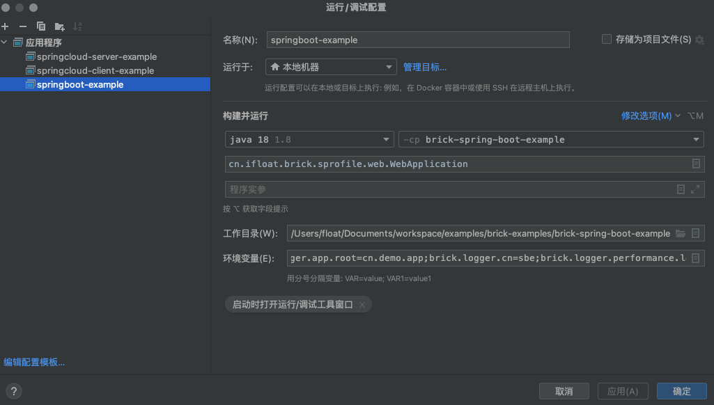
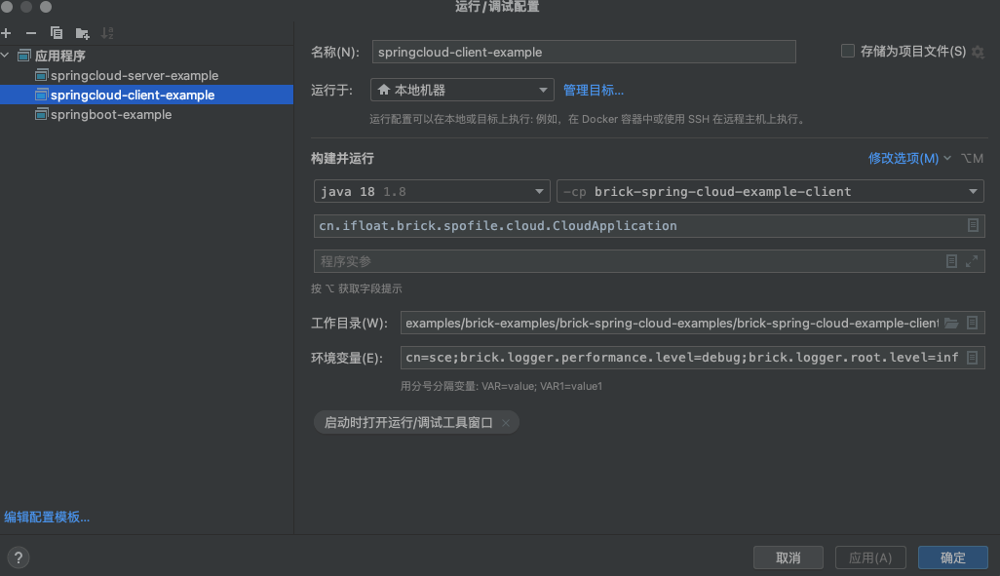
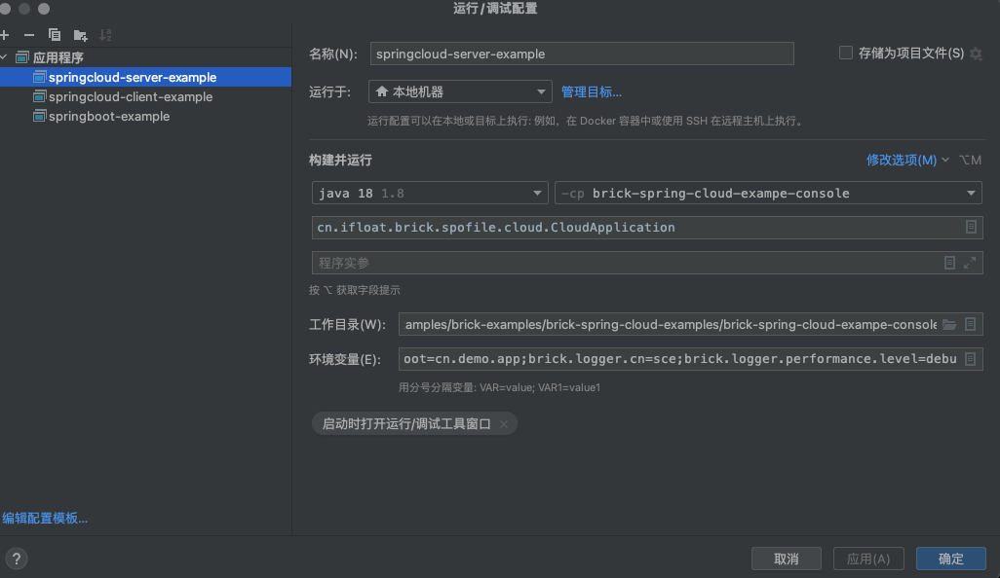

以下所有内容可参考: [brick-examples](https://gitee.com/f1oat/brick-examples) 

首先你要确定你要构建的项目服务组件启动类型,目前brick 提供了以下两种服务组件类型:

## SpringBoot

?> 参考brick-examples 中的  brick-spring-boot-example 示例代码

### 1. 构建父pom

```xml
<?xml version="1.0" encoding="UTF-8"?>
<project xmlns="http://maven.apache.org/POM/4.0.0"
         xmlns:xsi="http://www.w3.org/2001/XMLSchema-instance"
         xsi:schemaLocation="http://maven.apache.org/POM/4.0.0 http://maven.apache.org/xsd/maven-4.0.0.xsd">
   <!-- 父依赖 -->
   <parent>
        <artifactId>brick-spring-profile-common</artifactId>
        <groupId>cn.ifloat.brick.sprofile</groupId>
        <version>1.0.0-SNAPSHOT</version>
        <relativePath/>
    </parent>
    <modelVersion>4.0.0</modelVersion>
    <artifactId>brick-spring-profile-examples</artifactId>
    <packaging>pom</packaging>
   <!-- 子模块 -->
    <modules>
        <module>brick-spring-boot-example</module>
        <module>brick-example-common</module>
        <module>brick-spring-cloud-examples</module>
        <module>brick-example-service</module>
    </modules>
    <!-- 插件管理器 -->
    <build>
        <pluginManagement>
            <plugins>
                <!-- smart-doc -->
                <plugin>
                    <groupId>com.github.shalousun</groupId>
                    <artifactId>smart-doc-maven-plugin</artifactId>
                    <version>2.5.3</version>
                    <configuration>
                        <configFile>${basedir}/src/main/resources/smart-doc.json</configFile>
                        <projectName>brick-spring-profile-common</projectName>
                    </configuration>
                    <executions>
                        <execution>
                            <goals>
                                <goal>html</goal>
                            </goals>
                        </execution>
                    </executions>
                </plugin>
                <!-- mavan-javadoc -->
                <plugin>
                    <groupId>org.apache.maven.plugins</groupId>
                    <artifactId>maven-javadoc-plugin</artifactId>
                    <version>3.4.0</version>
                </plugin>
            </plugins>
        </pluginManagement>
    </build>
</project>

```

> 1. 参考[开发规约-Maven模块化](standard?id=Maven-模块化) 中的项目结构规范,定义父pom
> 1. 父依赖指向 `brick-spring-profile-common` 当中定义在springboot 环境下开发的核心组件
> 1. 插件管理器当中引入两个插件 ` java-doc/smart-doc` 将通过java doc的形式来生成对应的接口文档.

### 2. 项目启动入口pom

```xml
<?xml version="1.0" encoding="UTF-8"?>
<project xmlns="http://maven.apache.org/POM/4.0.0"
         xmlns:xsi="http://www.w3.org/2001/XMLSchema-instance"
         xsi:schemaLocation="http://maven.apache.org/POM/4.0.0 http://maven.apache.org/xsd/maven-4.0.0.xsd">
   <!-- 指向当前父依赖 --> 
   <parent>
        <artifactId>brick-spring-profile-examples</artifactId>
        <groupId>cn.ifloat.brick.sprofile</groupId>
        <version>1.0.0-SNAPSHOT</version>
        <relativePath />
    </parent>
    <modelVersion>4.0.0</modelVersion>
    <artifactId>brick-spring-boot-example</artifactId>


    <dependencies>
	      <!-- spring mvc 相关依赖 -->
        <dependency>
            <groupId>cn.ifloat.brick.sprofile</groupId>
            <artifactId>brick-sprofile-web</artifactId>
            <version>1.0.0-SNAPSHOT</version>
        </dependency>
        <!-- 按照特定需要引入 -->
        <dependency>
            <groupId>mysql</groupId>
            <artifactId>mysql-connector-java</artifactId>
            <version>8.0.16</version>
        </dependency>
        <!-- 当前业务处理的依赖 -->
        <dependency>
            <groupId>cn.ifloat.brick.sprofile</groupId>
            <artifactId>brick-example-service</artifactId>
            <version>1.0.0-SNAPSHOT</version>
        </dependency>
    </dependencies>
    <build>
        <plugins>
            <!-- 显示引入 smart-doc -->
          	<plugin>
                <groupId>com.github.shalousun</groupId>
                <artifactId>smart-doc-maven-plugin</artifactId>
            </plugin>
           <!-- 指定springBoot编译插件 指定公共启动入口 -->
            <plugin>
                <groupId>org.springframework.boot</groupId>
                <artifactId>spring-boot-maven-plugin</artifactId>
                <configuration>
                    <mainClass>cn.ifloat.brick.sprofile.web.WebApplication</mainClass>
                </configuration>
                <executions>
                    <execution>
                        <goals>
                            <goal>repackage</goal>
                        </goals>
                    </execution>
                </executions>
            </plugin>
        </plugins>
    </build>
</project>
```

> 1. `brick-sprofile-web` 中定义了spring-mvc 一些通用的配置和工具集,因此建议必须引入
> 2. 参考[开发规约-Maven模块化](standard?id=Maven-模块化)中的项目结构,如何设计SpringBoot组件模块
> 3. 指定 `spring-boot-maven-plugin` 编译可以将 SpringBoot 编译成整体的包方便后续 持续化集成或脚本启动

### 3. 编写你自己的代码

> 这里需要注意的是:
>
> 1. 参考[开发规约](standard)中定义的规范进行代码开发,
> 2. 为达到业务目的,进行合理合法的扩展与迭代

#### 在IDEA中运行你的SpringBoot 程序



> 1. 指定所需要加载的项目目录
> 2. 指定 `cn.ifloat.brick.sprofile.web.WebApplication` 作为默认的启动入口
> 3. 指定工作目录为加载的项目目录
> 4. 环境变量设置需要设置
>    1. 日志相关请参考服务组件中[日志组件]()应用
>       1. `brick.logger.app.level=info` : 指定应用日志输出等级
>       2. `brick.logger.app.root=cn.demo.app` : 指定应用日志输出的基础包路径
>       3. `brick.logger.cn=sbe`: 指定输出的日志 context name
>       4. `brick.logger.performance.level` : 指定性能日志输出的级别 
> 5. SpringBoot 默认的配置文件是 `application.yml` 参考 **SpringBoot 代码示例**
> 6. SpringBoot Example 当中的结构无限接近于真实开发场景下的目录结构,详细请参考[开发规约-Maven模块化](standard?id=Maven-模块化) 中的项目结构规范

?> 如果你跑通了 **SpringBoot Example** 那么恭喜你可以进行接下来的文档阅读,特别提醒的是在看其他说明文档之前一定要仔细阅读 [开发规约](standard)

## SpringCloud

?> 参考brick-examples 中的  brick-spring-cloud-examples示例代码

#### 1. 构建父pom

```xml
<?xml version="1.0" encoding="UTF-8"?>
<project xmlns="http://maven.apache.org/POM/4.0.0"
         xmlns:xsi="http://www.w3.org/2001/XMLSchema-instance"
         xsi:schemaLocation="http://maven.apache.org/POM/4.0.0 http://maven.apache.org/xsd/maven-4.0.0.xsd">
    <!-- 父依赖 -->
    <parent>
        <artifactId>brick-spring-profile-common</artifactId>
        <groupId>cn.ifloat.brick.sprofile</groupId>
        <version>1.0.0-SNAPSHOT</version>
        <relativePath/>
    </parent>

    <modelVersion>4.0.0</modelVersion>
    <packaging>pom</packaging>
    <artifactId>brick-spring-cloud-examples</artifactId>
    <groupId>cn.ifloat.brick.sprofile</groupId>
    <version>1.0.0-SNAPSHOT</version>
		<!-- 子模块 -->
    <modules>
        <module>brick-spring-cloud-example-api</module>
        <module>brick-spring-cloud-example-client</module>
        <module>brick-spring-cloud-example-server</module>
        <module>brick-spring-cloud-example-console</module>
    </modules>

    <build>
        <!-- 插件管理器 -->
        <pluginManagement>
            <plugins>
                <!-- smart-doc -->
                <plugin>
                    <groupId>com.github.shalousun</groupId>
                    <artifactId>smart-doc-maven-plugin</artifactId>
                    <version>2.5.3</version>
                    <configuration>
                        <configFile>${basedir}/src/main/resources/smart-doc.json</configFile>
                        <projectName>brick-spring-profile-common</projectName>
                    </configuration>
                    <executions>
                        <execution>
                            <goals>
                                <goal>html</goal>
                            </goals>
                        </execution>
                    </executions>
                </plugin>
                <!-- java-doc -->
                <plugin>
                    <groupId>org.apache.maven.plugins</groupId>
                    <artifactId>maven-javadoc-plugin</artifactId>
                    <version>3.4.0</version>
                </plugin>
            </plugins>
        </pluginManagement>
    </build>
</project>


```

> SpringCloud 和 Spring boot 的父依赖类似,参考 SpringBoot 快速开始 

#### 2. Client端 或 Server端 启动入口配置

```xml
<?xml version="1.0" encoding="UTF-8"?>
<project xmlns="http://maven.apache.org/POM/4.0.0"
         xmlns:xsi="http://www.w3.org/2001/XMLSchema-instance"
         xsi:schemaLocation="http://maven.apache.org/POM/4.0.0 http://maven.apache.org/xsd/maven-4.0.0.xsd">
		<!-- 父依赖 -->
    <parent>
        <artifactId>brick-spring-cloud-examples</artifactId>
        <groupId>cn.ifloat.brick.sprofile</groupId>
        <version>1.0.0-SNAPSHOT</version>
        <relativePath />
    </parent>

    <modelVersion>4.0.0</modelVersion>
    <packaging>jar</packaging>
    <artifactId>brick-spring-cloud-example-client</artifactId>

    <dependencies>
      <!-- SpringCloud 相关依赖 -->
      <dependency>
            <groupId>cn.ifloat.brick.sprofile</groupId>
            <artifactId>brick-sprofile-cloud</artifactId>
            <version>1.0.0-SNAPSHOT</version>
        </dependency>
      
        <!-- 项目基础包 -->
        <dependency>
            <groupId>cn.ifloat.brick.sprofile</groupId>
            <artifactId>brick-example-common</artifactId>
            <version>1.0.0-SNAPSHOT</version>
        </dependency>
        <dependency>
            <groupId>cn.ifloat.brick.sprofile</groupId>
            <artifactId>brick-spring-cloud-example-api</artifactId>
            <version>1.0-SNAPSHOT</version>
        </dependency>
        <dependency>
            <groupId>cn.ifloat.brick.sprofile</groupId>
            <artifactId>brick-spring-cloud-example-server</artifactId>
            <version>1.0.0-SNAPSHOT</version>
        </dependency>
    </dependencies>
    <build>
        <plugins>
             <!-- 显示引入 smart-doc -->
            <plugin>
                <groupId>com.github.shalousun</groupId>
                <artifactId>smart-doc-maven-plugin</artifactId>
            </plugin>
            <!-- 指定SpringBoot编译插件 指定启动入口-->
            <plugin>
                <groupId>org.springframework.boot</groupId>
                <artifactId>spring-boot-maven-plugin</artifactId>
                <configuration>
                    <mainClass>cn.ifloat.brick.spofile.cloud.CloudApplication</mainClass>
                </configuration>
                <executions>
                    <execution>
                        <goals>
                            <goal>repackage</goal>
                        </goals>
                    </execution>
                </executions>
            </plugin>
        </plugins>
    </build>
</project>

```

>1. `brick-sprofile-cloud` 中定义了spring-cloud 一些通用的配置和工具集,因此建议必须引入
>2. 参考[开发规约-Maven模块化](standard?id=Maven-模块化)中的项目结构,如何设计SpringCloudt组件模块
>3. 指定 `spring-boot-maven-plugin` 编译可以将 SpringBoot 编译成整体的包方便后续 持续化集成或脚本启动
>4. `需要注意的是 client pom当中引入了 server 包, 这涉及到一个 SpringCloud 转 SpringBoot 的重点,参考[SpringCloud组件 ](/)`  正常情况下SpringCloud client 是不需要引入server 相关模块. `*-api*包是client与server的桥梁`
>5. 示例当中的`brick-spring-cloud-example-server` 仅仅是一个接口实现, `brick-spring-cloud-exampe-console` 才是server 可执行入口 console 和client 的pom 结构上大径相同
>
>

### 3. 编写你自己的代码

> 这里需要注意的是:
>
> 1. 参考[开发规约](standard)中定义的规范进行模块设计,代码开发
> 2. 为达到业务目的,进行合理合法的扩展与迭代
> 3. 参考[开发规约](standard)SpringCloud项目结构方式构建
> 4. **一定要清晰的理解 SpringCloud 的模块化交互模型**
> 5. 默认支持 `nacos` 把`brick-spring-cloud-example-console` 和 `brick-spring-cloud-example-client` 中的 `brick-cloud-server-dev.yml brick-cloud-client-dev.yl` 导入到nacos中  

#### 4. 在IDEA中运行你的SpringCloud 程序





> 大致和SpringBoot 运行方式类似有几点不同的是:
>
> 1. SpringCloud 的启动类是  `cn.ifloat.brick.sprofile.cloud.CloudApplication`
> 2. SpringCloud 要区分客户端和服务端需要启动两个进程
> 3. 需要注意的是SpringCloud 的配置文件是 `bootstrap.yml ` 参考**SpringBoot代码示例**

?> 如果你跑通了 **SpringCloud Example** 那么恭喜你可以进行接下来的文档阅读,特别提醒的是在看其他说明文档之前一定要仔细阅读 [开发规约](standard)
