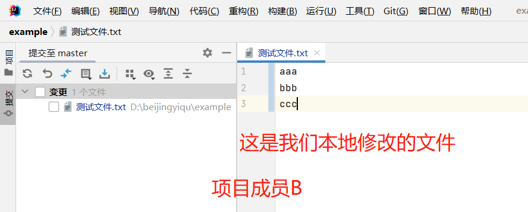

# sourcetree安装与使用

> SourceTree 是 Windows 和Mac OS X 下免费的 Git 和 Hg 客户端管理工具，同时也是Mn版本控制系统工具。支持创建、克隆、提交、push、pull 和合并等操作。
## sourcetree安装
### sourcetree下载

`sourcetree 官网地址`
https://www.sourcetreeapp.com/

### sourcetree安装步骤

### 安装完成

## 将本地已有git仓库交由sourcetree管理

### 点击`浏览按钮`选择git项目

### 点击`添加`

### 添加之后可以查看以往提交代码历史记录

## 为你的sourcetree配置外部合并工具

### 首先下载`Beyond Compare`比对工具

下载地址

https://www.123pan.com/s/HQeA-dD1Sh

下载后解压

将文件拖拽放入你的工作目录

在`sourcetree`选项中选择比较为其配置外部比对工具

对比命令选择`BCompare.exe`

这样你的`sourcetree`就配置好了

# 使用sourcetree进行`拉取`,`推送`,`提交`操作

## 多人协作开发出现代码冲突，如何合并代码？

`sourcetree`规范的使用详解

1. 先获取
2. 再贮藏
3. 再拉取
4. 再解决冲突
5. 再提交推送

- 使用sourcetree`提交`代码前先获取代码,**获取后可在`WORSPACE`下`history`中查看所有成员提交代码日志**

获取成功后可以看到日志历史信息中就可以看到`项目成员B`提交日志信息,此时`项目成员`的代码还没有合并到本地的代码中

- `获取`与`拉取`不同处在于`获取`不会将远程服务器上的`其他项目成员`提交的代码合并到你的的本地,他只是会提醒你当前提交代码的操作是需要合并代码的,也就是说需要先执行`拉取`操作

### 下面我们模拟一个项目成员合并代码出现冲突的情况

假设`项目成员A`要和`项目成员B`合作开发一个项目

- 此时`项目成员B`要提交代码

- 项目成员A已经提交到远程服务器的代码片段

- 项目成员B在同样的文件同样的位置编辑了这个文件

- 在这样的情况下`项目成员B`要提交他的代码

  项目成员B需要先进行`获取`再`贮藏`再`拉取`再`解决冲突`再`提交`,`推送`,代码

- 获取成功后显示如下

- 点击文件状态,进行`贮藏`,并为当前贮藏录入储藏日志信息
- 
- 应用贮藏之后本地代码恢复至原始远程服务器片段
- 
- 
- 点击拉取按钮,拉取`项目成员A`提交在远程服务器上的代码到你本地
- 
- 
- 应用贮藏,将之前贮藏的代码恢复至本地,此时需要合并代码,并解决冲突
- 
- 
- 提示文件有冲突,,解决冲突
- 

- 点击关闭按钮,解决冲突
- 

- 进入外部合并工具页面,合并代码
- 

- 选择代码内容进行合并代码
- 

- 合并完成点击保存
- 

- 回到`sourcetree`页面将文件标记为已解决
- 

- 点击确定按钮
- 

- 关闭外部合并工具,将后缀名为`.orig`的文件移除
- 

- 录入日志信息,勾选立即推送变更,点击提交按钮将合并后代码提交并推送至远程服务器
- 

- 此时远程服务器已经收到项目成员B合并后代码
- 

- 
到这里`成员B`与`成员A`合并代码就完成了